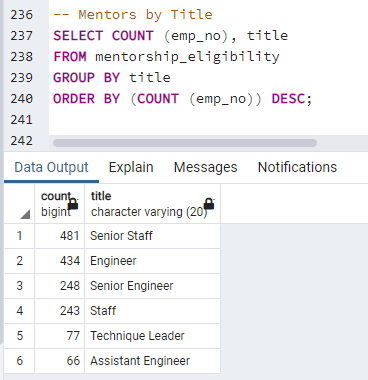
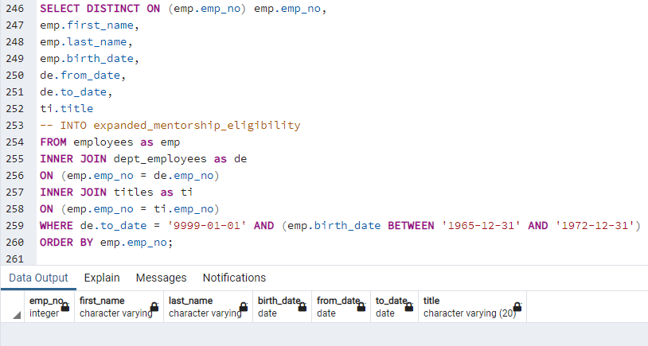

# Pewlett-Hackard-Analysis

## Overview

### Purpose

This analysis sought to determine the magnitude and impact of Pewlett Hackard's coming "silver tsunami" to help management prepare as a wave of current employees reach the company's retirement age.
Specifically, the number of retiring employees per title was determined, and a list of employees eligible to participate in Pewlett Hackard's mentorship program was created.

## Results
The analysis made four key findings.

Based on data from Retiring Titles:
* Pewlett Hackard's cadre of senior engineers will be the most impacted by attrition in the coming years, with over 25 thousand employees eligible for retirement.
* Senior staff at large will be the next hardest hit group, coming in at a close second with 24,926 retirement eligible employees.
* The Managerial staff will be the least impacted by the "silver tsunami" as a retiring group.

Based on data from Unique_Titles:
* Pewlett Hackard currently has 72,458 employees eligible for retirement (determined by the row count of the csv file, less the header).

Based on data from Mentorship Eligibility:
* There are 1,549 employees eligible to provide mentorship through the company's mentorship program.

## Summary
Pewlett Hackard will need to fill 72,458 roles as the "silver tsunami" begins to make an impact (based on the row count of Unique Titles as well as the total count of employees by title in Retiring Titles).

The company does not have enough qualified, retirement-ready employees in the departments to mentor the next generation of Pewlett Hackard employees based on limiting mentor qualifications.

The query below shows the number of eligible mentors by title.  Unfortunately, senior engineers and senior staff together amount to only 729 employees eligible mentors, which is only a fraction of the roughly 50 thousand who's positions will need to be filled when they retire during the silver tsunami.

The following query was ran to look at the impact of expanding mentorship eligibility, however, it was observed that there was no data for employees age 50 through 64.  This was also confirmed by looking at the employees table. If the data provided is up to date, this suggests there will be low attrition for at least a 7 year period following the silver tsunami, which may allow time to help in recovery from the impact of the wave of attrition.

